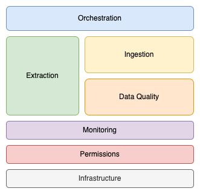

# Data Engineering Platform Architecture

## Platform's Modules

### Extraction
**Goal**: Extract data from source systems

**Premisse**: Integrates with source systems, therefore needs to be flexible on how to do so

**Out of Scope**: Shouldn't try to validate data, only extract it with as much efficiency possible

### Ingestion
**Goal**: Move/copy data available by Extraction process into analytical environment

**Premisse**: Basic data quality checks (schema and data types) before execution

**Out of Scope**: Doesn't necessarily delivers data to environment where analysts uses it

### Data Quality
**Goal**: Check if retrieved data from Extraction process has the expected metadata (schema and data types) and data profiles (descriptive analysis)

**Premisse**: Prior hipothesys on how the data should look like

**Out of Scope**: Notify stakeholders of hypothesis misalignment

### Orchestration
**Goal**: Manage processes execution order and flow controls

**Premisse**: Other processes can be started and managed from Orchestration environment

**Out of Scope**: Process execution within Orchestration environment

### Permission
**Goal**: Create/manage permissions and service/user accounts for plataform usage (including between modules)

**Premisse**: All authorizations for the platform should be done in this module as much as possible for control

**Out of Scope**: Corporate level authentication and authorization

### Monitoring
**Goal**: Apply observability in processes and data throught the whole platform environment for problem identification and early resolution as well as notification for interested parties

**Premisse**: Processes execution environments (Extraction, Data Quality, Ingestion and Orchestration) have ways to deliver (either by pulling or pushing) metrics, logs and traces

**Out of Scope**: Triggering different processes other then notification

### Infrastructure
**Goal**: Create basic environments where all other processes can be executed

**Premisse**: Clear and specific understanding on how supported process are going to be ran

**Out of Scope**: Execution specific infrastructure (ex: Docker images for every Extraction process)
